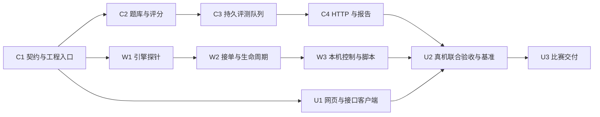

# Campus Compute Implementation Plan

> **For agentic workers:** REQUIRED SUB-SKILL: Use superpowers:subagent-driven-development (recommended) or superpowers:executing-plans to implement this plan task-by-task. Steps use checkbox (`- [ ]`) syntax for tracking.

**Goal:** 由 Codex 完成开发，为四位参赛队员交付可演示的 Mac／Windows 批量 AI 评测平台，支持机主控制、退出恢复与可追溯报告。

**Execution update:** 用户已明确全部开发由 Codex 实现。下文 A／B／C／D 仅保留为原模块分工，不要求人类队员编程。当前状态见 [开发记录](../../validation/implementation-progress.md)。

**Architecture:** 一个 Node.js 协调进程持久保存 SQLite 队列，原生 Worker 主动领取独立推理任务并调用本机 llama.cpp。网页负责发布、观察和报告；机主的控制页由本地 Worker 提供。所有节点共用同一模型及实验配置。

**Tech Stack:** Node.js 24.21.0、TypeScript 5、Fastify 5、Node 内置 SQLite、React 19、Vite 7、llama.cpp、Vitest 3。

**Spec:** [已确认策划案](../specs/2026-09-11-campus-eval-design.md)。执行者同时阅读本总计划、对应子计划与策划案；本文件保留实施约定；开发状态见执行更新与验收记录。

## Global Constraints

以下数值与产品约束来自策划案；三个子计划共同遵守此节，不在模块内另设默认值。

- 模型：`Qwen/Qwen2.5-1.5B-Instruct-GGUF`。
- 权重文件：`qwen2.5-1.5b-instruct-q4_k_m.gguf`。
- 上下文：2,048 tokens，包含聊天模板、题目、示例与输出预算。
- 输出上限：每题 128 tokens；达到上限保留结果并标记截断。
- 并发：每个物理设备一个 Worker、一个模型进程、一个在途题目。
- 心跳每 3 秒；有效领取／续期后租约延长 20 秒；协调服务每 1 秒回收过期租约；无任务时每 2 秒再询问；本地单题执行上限 120 秒。
- 一次任务最多容忍 3 次可重试故障；主动退出释放不计为故障。
- 低／中／高档分别在确认后休息 2t／t／0，t 只计本地推理耗时。
- 自定义 JSONL 最多 1,000 题、2 MB；2–8 个选项；正文 4,000 字符、单选项 1,000 字符；1–3 个模板、单模板 6,000 字符。
- 相同成功提交只接受一次；普通新计算记 1 credit；缓存和性能测试不计积分。
- 性能测试绕过结果缓存读写；正常实验可复用原始回答并按当前答案重新评分。
- 模型在本机真实运行；中央网页不能提高其他机主的贡献强度。
- SQLite、运行日志、配置中的私密令牌及权重放在本机未同步的数据目录。
- 先完成 P0；模型切片、训练、手机、自动闲置感知、精确资源百分比与正式安装包不进入本计划。

---

## 1. 计划入口与四人协作

| 计划 | 负责人 | 可独立验证的交付 |
|---|---|---|
| [A：协调与评测服务](2026-09-11-campus-compute-core.md) | A；D 负责题库与评分 | HTTP 发布、事务队列、结果评分与报告；测试客户端可调用 |
| [B：本地计算客户端](2026-09-11-campus-compute-worker.md) | B；D 配合 Windows 验证 | 原生引擎适配、本机控制、接单循环；协议测试服务可驱动 |
| [C：网页、基准与交付](2026-09-11-campus-compute-delivery.md) | C；D 负责基准与演示 | 两类网页、完整流程验收、真实测量与启动说明 |

当前目录只有策划文档，没有应用、依赖或 Git 仓库。后续执行时先确认团队已有的仓库位置；不要自动创建远程仓库、发布服务或向他人发送消息。独立工作区在执行阶段建立，本轮不创建。

分工中的 A／B／C／D 指人类队员。下面的并行安排不启动 AI 子代理；是否采用代理执行由后续执行请求决定。



H0–H3 优先 C1、C2 的数据固定和 W1 的两系统试跑；H3–H6 用 C3、C4、W2 的最短流程拿到真实回答。H6–H14 补全恢复、缓存、控制和页面。H14 后冻结功能并完成 U2、U3。代码片段是各步骤的明确实现起点与算法约定，放入源码后仍需运行对应检查。

## 2. 文件归属

采用一个 npm 包，避免一天内维护多个构建系统。所有路径相对项目根目录。

```text
package.json / package-lock.json / tsconfig.json / vite.config.ts
src/shared/contracts.ts          浏览器与服务共用的纯类型
src/shared/limits.ts             所有默认参数
src/shared/schemas.ts            HTTP 边界 Zod 校验
src/shared/errors.ts             统一错误码与输入行号
src/domain/dataset.ts            JSONL 校验、标签规范化
src/domain/prompts.ts            三个默认模板与消息渲染
src/domain/score.ts              答案解析与格式评分
src/domain/keys.ts               配置、数据与计算哈希
src/server/schema.sql            SQLite 表、外键与唯一索引
src/server/db.ts                 数据库打开、迁移与事务
src/server/store.ts              持久化服务门面
src/server/experiments.ts         预览、创建、缓存及取消
src/server/leases.ts             领取、续期、释放与回收
src/server/results.ts            结果事务、重放、贡献
src/server/report.ts             共同子集、吞吐与导出
src/server/auth.ts               令牌创建、摘要与角色检查
src/server/app.ts / main.ts      Fastify 路由与进程启动
src/worker/config.ts             本机路径、引擎清单与配置
src/worker/engine.ts             llama.cpp 启动、分词、生成和终止
src/worker/client.ts             协调协议与超时错误分类
src/worker/runner.ts             单任务循环、独立心跳与机主控制
src/worker/control.ts / main.ts  loopback 服务与进程入口
src/web/index.html / main.tsx    页面入口
src/web/api.ts / App.tsx         请求与页面分流
src/web/Publish.tsx              题库、模板、预览与提交
src/web/Experiment.tsx           进度、设备、结果与导出
src/web/Contribute.tsx           本机连接配置、档位与退出
src/web/styles.css              可读的三分钟展示界面
scripts/prepare-arc.ts           抽样、固定示例和数据清单
scripts/probe.ts                 真机模型探针与清单生成
scripts/benchmark.ts             基准组织与原始 JSON 输出
scripts/start-worker.sh / .ps1  原生启动入口
tests/core/                     C1–C4 自动化用例
tests/worker/                   W1–W3 协议与生命周期用例
tests/integration/              U1–U2 联合用例
tests/fixtures/                 明确标为测试的数据和模拟服务
data/arc-demo.jsonl              执行准备脚本后产生的真实题库
data/arc-examples.json           固定训练集示例
data/arc-source.snapshot.json    已下载的原始数据快照
data/dataset.lock.json           真实数据来源、revision、哈希与 IDs
config/runtime.lock.json         真机探针后生成的非敏感引擎／模型清单
docs/validation/                 验收记录与实际报告
docs/runbook.md                  队员启动与演示说明
```

`server/store.ts` 只组合模块，不承载所有 SQL。A 拥有 shared 的合并权；D 修改 domain；B 修改 worker；C 修改 web。其他人需要改契约时先同步所有调用方与测试，不让分支各自增加近义字段。

## 3. 统一类型契约

C1 将下列类型写入 `src/shared/contracts.ts`。类型使用 JSON 可序列化值；本地函数接口另列在各子计划。`Sample` 只供协调服务，Worker 领取响应不得序列化它的 `answerKey`。

```ts
export type Level = "low" | "medium" | "high";
export type Backend = "metal" | "cuda" | "cpu";
export type Mode = "normal" | "benchmark";
export type ResponseMode = "answer-only" | "explanation";
export type TaskState = "queued" | "leased" | "completed" | "failed" | "canceled";
export type WorkerState = "initializing" | "ready" | "computing" | "uploading" |
  "resting" | "pausing" | "paused" | "stopping" | "stopped" | "error" | "offline";
export type ExperimentState = "queued" | "running" | "completed" |
  "completed-with-errors" | "canceled";
export type ErrorCode = "VALIDATION" | "UNAUTHORIZED" | "NOT_FOUND" |
  "LEASE_LOST" | "CONFIG_MISMATCH" | "INPUT_TOO_LONG" | "ENGINE_ERROR" |
  "EXECUTION_TIMEOUT" | "NETWORK" | "STOPPED";
export interface Choice { label: string; text: string }
export interface PublicSample { id: string; question: string; choices: Choice[] }
export interface Sample extends PublicSample {
  answerKey: string;
  originalLabels: string[];
}
export interface Variant {
  id: string; name: string; instruction: string;
  examples: Sample[]; responseMode: ResponseMode;
}
export interface Message { role: "system" | "user" | "assistant"; content: string }
export interface Generation {
  contextSize: 2048; maxTokens: 128; temperature: 0;
  seed: 42; cachePrompt: false;
}
export interface RuntimeLock {
  adapterVersion: "llama-completion-v1";
  modelRepo: string; modelRevision: string; modelFile: string;
  modelSha256: string; engineVersion: string; chatTemplateSha256: string;
  generation: Generation; inferenceKey: string;
  artifacts: { platform: string; arch: string; backend: Backend;
    binarySha256: string; executable: string; prefix: string[] }[];
}
export interface DatasetMeta {
  id: string; name: string; sha256: string; source: string;
  revision: string; license: string; sampleIds: string[];
}
export interface ImportInput { name: string; jsonl: string; source: string; revision: string; license: string }
export interface CreateInput {
  name: string; datasetId: string; sampleIds: string[];
  variants: Variant[]; mode: Mode;
  benchmark?: { policy: "dynamic" | "static"; workerIds: string[]; held: boolean };
}
export interface Preview { total: number; cached: number; fresh: number }
export interface Created { experimentId: string; ownerToken: string; preview: Preview }
export interface Registration {
  name: string; platform: string; arch: string; cpu: string; memoryBytes: number;
  backend: Backend; inferenceKey: string;
}
export interface WorkerSession { workerId: string; token: string }
export interface LeaseRef { experimentId: string; taskId: string; leaseId: string; workerId: string }
export interface Lease extends LeaseRef {
  inferenceKey: string; messages: Message[]; generation: Generation;
  remainingLeaseMs: number; remainingAttemptMs: number;
}
export interface InferenceOutput {
  text: string; finishReason: "stop" | "length";
  inputTokens: number; outputTokens: number; inferenceMs: number;
}
export interface SubmitInput extends LeaseRef {
  inferenceKey: string; backend: Backend; output: InferenceOutput;
}
export interface Receipt { taskId: string; resultId: string; acceptedAt: number; credit: number }
export interface FaultInput extends LeaseRef { code: ErrorCode; message: string }
export interface Heartbeat {
  state: WorkerState; level: Level; lease: LeaseRef | null;
}
export interface HeartbeatReply {
  leaseValid: boolean; remainingLeaseMs: number; remainingAttemptMs: number;
  receipt: Receipt | null;
}
export interface Score { answer: string | null; correct: boolean; formatOk: boolean }
export interface EventRow { id: number; at: number; kind: string; taskId: string | null; workerId: string | null; detail: string }
export interface WorkerView extends Registration {
  id: string; state: WorkerState; level: Level; lastSeenAt: number;
  completed: number; credits: number;
}
export interface VariantSummary {
  id: string; received: number; planned: number; failed: number; truncated: number;
  commonCorrect: number; commonFormatOk: number;
}
export interface Snapshot {
  experimentId: string; name: string; mode: Mode; state: ExperimentState;
  planned: number; fresh: number; cached: number; leased: number;
  queued: number; failed: number; canceled: number; retries: number;
  commonCount: number; variants: VariantSummary[]; workers: WorkerView[];
  throughput: number; windowMs: number; etaSeconds: number | null;
  startedAt: number | null; finishedAt: number | null; events: EventRow[];
}
export interface ReportRow {
  taskId: string; sampleId: string; variantId: string; state: TaskState;
  source: "computed" | "cache" | null; resultId: string | null;
  workerId: string | null; backend: Backend | null;
  output: InferenceOutput | null; score: Score | null;
  acceptedAt: number | null; error: string | null;
}
export interface AttemptRow {
  leaseId: string; taskId: string; workerId: string; state: string;
  startedAt: number; endedAt: number | null;
}
export interface Report {
  snapshot: Snapshot; dataset: DatasetMeta; samples: Sample[];
  variants: Variant[]; runtime: RuntimeLock; scoringVersion: "answer-line-v1";
  rows: ReportRow[]; attempts: AttemptRow[]; events: EventRow[];
}
export interface WorkerConfig {
  coordinatorUrl: string; joinCode: string; name: string; backend: Backend;
  engineBin: string; enginePrefix: string[]; modelPath: string;
  enginePort: number; controlPort: number; stateDir: string;
}
export type ControlCommand =
  { action: "configure"; coordinatorUrl: string; joinCode: string; name: string } |
  { action: "start" } | { action: "pause" } | { action: "exit" } |
  { action: "set-level"; level: Level };
export interface LocalStatus {
  state: WorkerState; level: Level; workerId: string | null;
  taskId: string | null; enginePid: number | null;
  coordinatorUrl: string; name: string; backend: Backend;
  completed: number; lastError: string | null;
}
```

`RuntimeLock` 的哈希和版本从真实文件、引擎版本输出与模板产生；不能写假哈希来绕过检查。W1 生成后，协调服务和所有客户端启动时校验。路径属于各机配置，模型语义指纹不包含路径、显卡类型或操作系统。

新增的 `benchmark` 字段及 `/api/experiments/:id/start` 只用于基准：冻结参与设备、固定分配策略和统一放行。start 原子设置 started_at 并清除 held；普通实验在首次领取时设置 started_at。普通模式必须拒绝 benchmark 字段；这是策划案性能协议的实现细化。

## 4. 共享参数与状态原则

```ts
export const LIMITS = Object.freeze({
  heartbeatMs: 3_000, leaseMs: 20_000, sweepMs: 1_000,
  idlePollMs: 2_000, attemptMs: 120_000, maxFaults: 3,
  maxDatasetBytes: 2_000_000, maxSamples: 1_000,
  minChoices: 2, maxChoices: 8, maxQuestionChars: 4_000,
  maxChoiceChars: 1_000, maxVariants: 3, maxInstructionChars: 6_000,
  maxOutputBytes: 64_000, snapshotPollMs: 2_000,
  throughputWindowMs: 30_000,
});
export const GENERATION = Object.freeze({
  contextSize: 2048, maxTokens: 128, temperature: 0,
  seed: 42, cachePrompt: false,
} as const);
```

MB／KB 在本实现中取十进制字节上限；字符数按 Unicode code points 计数。轮询结果只在收到服务确认后更新状态。暂停请求先显示 pausing，当前结果确认后再显示 paused。

任务成功回放先查原 receipt，再验证当前租约是否有效。身份检查始终在回放检查之前。租约回收和接受结果都使用短同步事务；事务内部不能 await 网络或执行模型。

心跳若携带已经被接受的本会话 lease，返回原 receipt；客户端先处理 receipt 再处理 leaseValid。这样提交响应丢失时，不会把已成功任务误判成失效任务。stopping 表示正在结束进程，只有进程确实退出才进入 stopped。

## 5. 端点与鉴权表

| 方法与路径 | 身份 | 请求 → 响应 |
|---|---|---|
| `GET /api/bootstrap` | 本机页面或小组页面 | `{surface:"coordinator"}` 或 `{surface:"worker",token:string}`；本机 token 不跨域提供 |
| `GET /api/datasets` | 加入码 | `DatasetMeta[]`，包括内置数据 |
| `GET /api/defaults` | 加入码 | `{variants:Variant[],runtime:RuntimeLock}` |
| `POST /api/datasets` | 加入码 | `ImportInput → DatasetMeta` |
| `POST /api/experiments/preview` | 加入码 | `CreateInput → Preview` |
| `POST /api/experiments` | 加入码 | `CreateInput → Created` |
| `GET /api/experiments/:id` | 加入码 | `Snapshot` |
| `GET /api/experiments/:id/report` | 加入码 | `Report` |
| `POST /api/experiments/:id/cancel` | 管理令牌 | 空 body → `{ok:true}` |
| `POST /api/experiments/:id/start` | 管理令牌 | 只允许 held 基准 → `{ok:true}` |
| `POST /api/workers/register` | 加入码 | `Registration → WorkerSession` |
| `POST /api/workers/:id/heartbeat` | Worker 令牌 | `Heartbeat → HeartbeatReply` |
| `POST /api/tasks/claim` | Worker 令牌 | 空 body → `Lease` 或 204 |
| `POST /api/tasks/:id/result` | Worker 令牌 | `SubmitInput → Receipt` |
| `POST /api/tasks/:id/release` | Worker 令牌 | `LeaseRef → {ok:true}` |
| `POST /api/tasks/:id/error` | Worker 令牌 | `FaultInput → {ok:true}` |
| `POST /api/workers/:id/leave` | Worker 令牌 | 空 body → `{ok:true}` |
| `GET /api/local/status` | 本机 token | `LocalStatus` |
| `POST /api/local/control` | 本机 token + Origin | `ControlCommand → LocalStatus` |

令牌都使用 `Authorization: Bearer ...`，不得进入 URL 或日志。错误响应固定为 `{error:{code:ErrorCode,message:string,line?:number}}`；400 输入、401 身份、404 不存在、409 租约／配置失效、503 临时服务错误。已成功接受的旧结果回放返回 200 原 receipt。

## 6. 验收覆盖与停止条件

| 策划验收 | 实施任务 |
|---|---|
| A01 导入发布、A02 评分 | C2、C3、U1 |
| A03 跨系统、A04 8GB 体验、A15 模型一致 | W1、W3、U2 |
| A05 调度、A09 失联、A10 竞争、A12 恢复 | C3、C4、W2 |
| A06 档位、A07 暂停、A08 退出 | W2、W3、U2 |
| A11 缓存、A13 积分 | C3、C4 |
| A14 报告 | C4、U1 |
| A16 网络与控制权限 | C4、W3、U2 |
| A17 基准、A18 演练 | U2、U3 |

H3 必须有最低配置 Mac 和实际 Windows 的探针记录。若缺某台真机，其他模块可继续开发，但对应验收保持未完成。H6 必须让一个真实 Worker 完成一场评测；H14 冻结功能。协议自动化通过后不反复扩大测试范围，转入必要的真机检查。

## 7. 工具版本与来源

Node.js 24.21.0 为本次查到的 LTS 发布；Node 24 的 `node:sqlite` 提供同步数据库 API，适合单个小型协调进程。[Node 版本](https://nodejs.org/en/blog/release/v24.21.0)、[SQLite API](https://github.com/nodejs/node/blob/v24.x/doc/api/sqlite.md)

Fastify 使用注入请求测试，不要求为每个接口测试启动真实端口。[官方测试文档](https://fastify.dev/docs/latest/Guides/Testing/)

llama.cpp 的模板化、分词与生成接口在 W1 用真实引擎逐项检查后冻结；API 验证失败即停止该引擎组合进入 ready。[服务文档](https://github.com/ggml-org/llama.cpp/blob/master/tools/server/README.md)

JavaScript 依赖在 C1 以指定主版本安装并使用 `--save-exact`，提交产生的 lockfile；后续所有队员使用 `npm ci`。不在计划中伪造未解析的补丁版本或模型哈希。

## 8. 原计划交付说明（实施前记录）

实施前交付的计划包含 10 个开发任务和 3 份分工子计划，覆盖策划案 A01–A18。当时已进行文档交叉引用、任务依赖与接口口径自查，并独立解析数据库建表语句。代码片段为实施约定，尚未作为应用编译或执行；所有开发及真机验收复选框保持未勾选。

开工优先级为 C1 的共享契约与 W1 的实际设备探针；随后用 C2–C4 与 W2 跑通单节点真实评测。界面、缓存和恢复按子计划接入，不以先完成页面数量代替整条流程可用。
