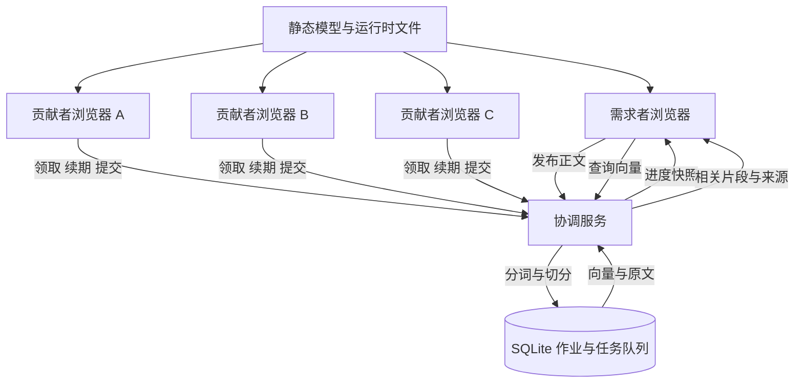

# HackCMU 校园算力互助平台策划案

> **历史方案，已被取代。** 当前策划案为 [2026-09-11 校园算力互助评测平台](2026-09-11-campus-eval-design.md)。本文保留讨论记录，不作为当前开发依据；浏览器文档索引与手机推理已退出首版范围。

> 版本：讨论后设计稿 v0.2 · 2026-09-09  
> 阶段：产品与技术策划；本文中的指标是开发验收目标，尚无设备实测结果。  
> 工作名称：Campus Compute（暂用名称，不代表名称可注册或具有独占性）。

## 1. 项目要做成什么

学生打开网页，自主选择贡献强度，将电脑的一部分计算能力用于帮助校园成员完成批量 AI 任务；参与者可以暂停、退出和重新加入。需求者可以发布任务、查看进度，并拿到可实际使用的结果。

黑客松首版采用“每台参与电脑运行完整小模型，处理不同的数据批次”的架构。首个任务类型是：**为公开英文资料生成文本向量，建立可搜索的资料库**。

成功的现场演示应完成以下过程：

1. 一位需求者发布真实的资料索引任务。
2. 至少两台独立电脑通过浏览器完成不同批次的真实推理。
3. 新节点加入，开始分担剩余任务。
4. 一位参与者降低贡献强度，或突然退出。
5. 未完成批次被重新领取，其他节点继续完成工作。
6. 需求者搜索资料，参与者看到按有效结果累计的贡献记录。

核心展示主张是“临时组成、由参与者控制的校园算力互助”。性能提升是需要测量的结果，不预先承诺倍率，也不把降低整体能耗作为首版结论。

## 2. 已确认方向与排期假设

| 项目 | 本稿采用的条件 | 状态 |
|---|---|---|
| 时间 | 约一天完成 demo | 用户给定；具体赛程以赛事规则为准 |
| 推理方式 | 完整小模型、独立任务并行 | 已接受方向 |
| 参与方式 | 浏览器打开链接，主动点击开始后自动领取任务 | 已讨论方向 |
| 产品结构 | 同一网站包含需求端、贡献端和结果页 | 已讨论方向 |
| 任务场景 | 公开英文资料的语义检索索引 | 本稿具体化采用的首发场景 |
| 队伍 | 约 4 人 | 用户确认；具体技术熟悉程度尚未给定 |
| 设备 | 4 台普通笔记本 | 用户确认；系统、内存和性能需早期实测 |
| 现场扩展 | 评委可能用手机参与 | 用户提出；设计为可选计算节点，按实际能力接入 |
| 网络 | 所有演示设备可访问同一个服务地址 | 开发早期验证条件 |
| 用户范围 | 受信任的参赛队员及演示参与者 | 首版范围 |

本稿创建前工作目录为空。本稿是设计文档，不假定已有代码、已完成部署、已验证性能或已获得外部服务额度。

四台笔记本的演示分配：1 台负责主屏幕、发布任务和搜索，另外 3 台贡献计算。若使用本地协调服务，运行在主屏幕电脑上；性能比较时记录这一部署条件。评委手机可成为额外节点，主演示不依赖陌生手机成功初始化。

## 3. 为什么有人需要它

### 3.1 需求侧

候选需求者是整理公开研究资料的学生小组，或需要整理公开说明文档的校园社团。他们拥有一批文本，希望按含义搜索，而不只按关键词匹配。

平台接受文本，分发建立索引所需的计算，最后提供带原文与来源的搜索结果。首版返回相关片段，不生成聊天回答。

需要验证的需求假设：

- 数据规模足以让批量计算有明显等待时间。
- 使用者愿意让其他参与设备处理这些公开文本。
- 使用者认为快速招募几位同学协助计算，比单机等待有价值。
- 贡献者认为参与和退出足够方便，资源占用可以接受。

这些假设不能仅由技术跑通证明。准备演示时，应让至少一位真实候选使用者提交一批资料，并记录其反馈。若任务在单机上很快完成，应如实将其定位为系统能力演示，继续寻找更合适的实际工作负载。

### 3.2 供给侧

贡献者打开页面后看到任务用途、将处理的数据类型、模型下载提示和贡献档位。点击开始才下载与执行；运行中始终能看到暂停和退出入口。

参与动机先采用互助、可见贡献和小组内认可。首版免费发布任务，积分用于显示贡献，不引入交易、提现或发布任务必须付积分的门槛。

### 3.3 与已有项目的关系

BOINC 已包含志愿计算、资源偏好和贡献积分；Petals 与 exo 已研究或实现跨设备模型推理。[S1][S2][S3][S4]

本项目不将这些单项能力宣称为首创。参赛作品的具体贡献是：在一个校园任务场景中，整合浏览器参与、真实任务发布、贡献强度控制、退出恢复与可用结果，并用现场操作证明它们协同工作。

## 4. 首版范围

| 优先级 | 内容 | 完成后的可观察行为 |
|---|---|---|
| P0 | 创建资料索引作业 | 提交文本后产生独立作业与可处理批次 |
| P0 | 浏览器实际推理 | 两台电脑分别返回由本机生成的向量 |
| P0 | 节点接入和模型加载 | 区分下载中、初始化中、可领取任务与计算中 |
| P0 | 贡献强度和退出 | 档位影响领取间隔；暂停、退出始终可操作 |
| P0 | 超时重试和结果去重 | 断线批次可重新完成；同一结果不重复累计 |
| P0 | 任务进度与节点贡献 | 显示真实完成量、重试量和节点状态 |
| P0 | 资料搜索 | 使用同一模型处理查询，返回相关片段与来源 |
| P0 | 简单积分 | 每个被接受的文本片段只记一次贡献 |
| P0 | 手机扫码入口与能力检查 | 可查看进度；通过推理检查后才成为计算节点，失败有明确提示 |
| P1 | 扩展手机兼容覆盖 | 在更多 Android/iOS 机型上验证真实推理 |
| P1 | 结果导出 | 导出原文、来源、向量和模型处理标识 |
| P1 | 更丰富的图表 | 展示吞吐趋势和节点处理记录 |
| P1 | WebGPU 路径 | 仅在基础 WASM 方案稳定后评估 |

首版范围外：模型切片、训练、任意代码执行、任意模型上传、PDF/OCR/爬虫、中文质量承诺、持续后台原生客户端、支付、完整账户系统、陌生节点强防作弊、多协调服务器容错。

如果开发晚于预定时间，先删除 P1。发布作业、真实推理、退出恢复和可用搜索结果构成同一条最小产品流程，不将其拆成互不相连的展示页面。

## 5. 用户流程与页面

### 5.1 发布任务

发布入口固定提供“建立英文资料搜索索引”。用户填写作业标题，导入结构化 JSON 文本资料，或直接粘贴一份英文文本。

资料记录包含标题、正文和可选来源链接。来源链接只作为来源展示，不由服务器自动抓取网页。输入页面明确这些正文会交给参与设备处理。

默认上限：每个作业 2 MB UTF-8 输入、最多 2,000 份文档、切分后最多 5,000 个片段。空正文、超限输入和字段类型错误在创建批次前返回具体原因，不产生半个作业。

发布后进入作业页。无人参与时显示“等待计算节点”；有人执行时显示“已完成片段 / 总片段、正在处理的批次、在线且准备好的节点数”。

### 5.2 贡献算力

贡献者输入昵称、选择当前作业、选择轻量或标准档位，点击开始。浏览器加载模型后领取任务。首版贡献者一次只支持一个指定作业，避免多作业公平调度扩大范围。

页面显示：贡献档位、模型加载进度、当前状态、已完成片段、积分，以及暂停与退出按钮。不展示无法可靠测得的整机 CPU 百分比或温度。

暂停表示“停止领取新任务，完成当前小批次后暂停”，保留模型供恢复使用。立即退出则终止计算 Worker、释放当前会话持有的推理资源，并尽力通知服务器释放任务；即使通知失败，超时回收也能生效。

退出后内存释放时机还受浏览器控制；缓存文件可能继续保留，以减少下次加入的下载成本。页面关闭、系统睡眠、后台节流都按节点可能变慢或断线处理。[S8]

### 5.3 查看和使用结果

作业完成后，需求者输入英文问题或描述。需求者自己的浏览器加载相同模型，生成查询向量，服务器据此计算与已存向量的相似度，返回前 5 个片段和来源。

查询模型首次加载单独显示进度。协调服务器不代替贡献者执行语料模型推理；它可以执行分词、结果存储和向量相似度计算。

未完成但已有结果的作业可以搜索已完成部分，结果页明确标注“部分索引，覆盖 X/Y 片段”。存在失败批次时不能显示“全部完成”。

### 5.4 演示总览

总览以真实状态为主：当前作业进度、节点列表、最近完成记录、重新分配记录、累计贡献。若加入节点关系图，连线表示连接或任务流，不用动画暗示未发生的真实计算。

### 5.5 评委手机扫码参与

主屏幕展示当前作业的二维码，手机扫码后先进入轻量进度页。默认不下载模型，也不自动开始计算。手机提供“贡献一次”入口：说明将下载约 23 MB 模型权重及额外运行资源，用户点击后才开始。

接入顺序：检查 WebAssembly 与 Worker 能力 → 下载/初始化 → 本机试算 → 成为可领取节点 → 完成一个真实批次 → 自动停止并展示个人贡献。试算使用固定自编文本，覆盖当前任务的最大批次与片段长度；它不产生任务完成量或积分。试算输出合法且耗时不超过 5 秒，才进入计算状态。这是初始体验门槛，H0–H3 用借到的手机验证。

手机准备好时若作业已经结束，显示“本次作业已完成”，不制造虚拟任务或虚构贡献。

手机使用与笔记本相同的模型、精度和处理方式，默认仅贡献一次，愿意继续时可手动再开始；不在首次入口要求填写复杂表单。计算过程中显示正在处理的片段数量和退出按钮。即使用户退出，进度查看入口仍可使用。

不能仅因扫码或下载成功就把手机计为算力节点。能力检查、初始化或试算失败时显示原因并保留查看模式；模型加载超过 45 秒时主动提示可以取消加载、继续观看。不兼容设备不能由服务器代算后冒充手机贡献。

优先测试 Android Chrome 与 iPhone Safari 的 WASM 路径。ONNX Runtime 文档列出移动浏览器的 WASM 支持，但这不保证每一台手机都能承受具体模型的内存与计算负担。[S10] 不依赖手机 WebGPU；锁屏、切到别的应用和浏览器冻结都按潜在断线处理。

手机页面按 360 px 宽度检查可读性，主要按钮至少 44 px 高。为避免错过加入时机，可在介绍项目时邀请评委扫码，模型加载与讲解同时进行；始终单独标示首次加载状态。

## 6. 技术架构与部署

建议使用 React、Vite、TypeScript 构建前端，Node.js 与 Fastify 承担协调接口，SQLite 保存状态；浏览器使用 Transformers.js、ONNX Runtime Web 与一个专用 Web Worker。此处是建议技术栈，不表示已有这些依赖。[S6][S7]

任务领取、续期和提交采用 HTTP 请求；首版进度每 2 秒轮询一次快照。WebSocket 可作为后续改进，不作为一天 demo 的依赖。

线上演示使用一台可持久运行 Node 进程、持久保存 SQLite 文件的服务。网站和 API 通过同一 HTTPS 源提供，模型资产也尽量同源托管。SQLite 队列仅由这个服务操作，不放到多个无共享状态的临时函数实例上。

参与浏览器主动连接协调服务，不要求电脑之间直接连通。早期测试校园网络能否访问所选地址；若不可用，改用已经验证的热点或局域网服务。纯 WASM 单线程作为局域网回退路径时，不依赖 WebGPU 或跨源隔离。

准备阶段下载固定版本的模型、分词器和 WASM 文件，保留各自许可及文件清单。正式演示避免临时从多个第三方地址下载依赖。模型可以自托管，具体配置受所选运行时版本约束。[S9]

协调服务器是首版的单点。进程重启后从 SQLite 恢复任务，并在租约到期后重新分配；服务器不可访问期间，各浏览器停止领取并显示连接异常。

## 7. 模型与数据处理规范

### 7.1 初始候选

- 模型：`Xenova/all-MiniLM-L6-v2` 的量化 ONNX 版本。
- 已核查的候选权重文件：`model_quantized.onnx`，页面标示约 23 MB。FP32 版本约 90.4 MB；这些数值不含运行时和其他资产，也不是运行内存测量。[S5]
- 任务：英文句子和短段落向量提取。
- 输出：384 维向量；采用带 attention mask 的 mean pooling，再作 L2 normalization。[S6]
- 运行：WASM 单线程、一个专用计算 Worker、一个在途批次。
- 不要求浏览器获得 GPU。`numThreads = 1` 用于减少多线程环境差异；单线程也可能短时间占满一个逻辑核心，不等于整机资源百分比保证。[S7]

在第一个开发里程碑固定模型仓库完整 revision、所用文件哈希、运行时版本和 lockfile。它们共同生成 `modelKey`，所有入库结果与查询必须匹配同一 `modelKey`。若候选量化格式不兼容，按第 14 节整体切换后重新构建索引，不混用结果。

### 7.2 切分与批次

原模型默认会截断超过 256 word pieces 的输入，因此平台需要主动切分长文，而不是依靠静默截断。[S6]

初始规则：服务端使用固定的同款 tokenizer，按段落和句子边界组织片段；每片段重新编码后的长度不超过 240 tokens（含特殊 token）。超长单句按 tokenizer 窗口切分，相邻窗口目标重叠 32 个正文 token；重编码后再次检查长度并收缩窗口直至合格。片段保留文档 ID 与顺序。

每批最多 4 个片段，每个 Worker 同时只持有 1 个批次。查询长度也检查，超过 240 tokens 时提示缩短，避免静默丢失查询内容。

首轮测试期望在演示设备上将批次执行时间控制在约 0.3–2 秒量级，以兼顾调度成本和交互响应。这是选型目标：如果机器更慢，减为 1 个片段；如果显著过快且调度成为瓶颈，可以增加批次。每次变更后重新验证退出延迟与内存，随后冻结全场配置。

### 7.3 贡献档位

| 档位 | 领取规则 | 用户含义 |
|---|---|---|
| 轻量 | 本批完成并获服务器确认后，等待约本批推理耗时再领取 | 主动留出计算间隔 |
| 标准 | 本批完成并确认后立即领取下一批 | 连续处理，仍保持一个在途批次 |
| 暂停 | 不领取新批次；完成当前批次后停止 | 保留模型，便于继续 |
| 立即退出 | 终止计算 Worker，并释放或等待回收当前批次 | 停止参与当前会话 |

轻量档等待时间限制在 0.2–3 秒，以避免极短批次或异常耗时导致不合理休息。档位切换在下一次领取前生效；等待中的暂停、退出应立即取消后续领取。

这些档位控制工作节奏，不宣称精准限制 CPU、GPU、内存或功耗，也不宣称能自动识别整台电脑是否忙碌。

## 8. 调度、断线和一致性

### 8.1 任务生命周期

`queued → leased → completed`

租约超时、主动释放或节点报告可重试错误：`leased → queued`。同一任务累计 5 次领取仍未完成，进入 `failed`，不无限重试。作业显示失败批次和已完成比例；首版修正设备问题后通过重新发布作业重做，不提供原作业内手动重置次数的入口。

创建作业时在事务中保存文档、片段和任务。领取时在事务中选取本作业最早的排队任务，生成不可复用的 `leaseId`，保存 `workerId` 与期限后返回。两个浏览器不能同时领取同一个有效租约。

### 8.2 初始时间参数

- Worker 每 3 秒发送一次心跳；有在途任务时携带 `leaseId` 续期。
- 租约有效期为服务器收到领取或有效续期后的 15 秒。
- 服务器每 1 秒扫描过期租约。
- 一个批次单次领取的总寿命最多 60 秒，持续心跳也不能无限占有。
- 节点超过 10 秒无心跳标记为疑似离线；任务是否回收以租约为准。
- 无任务时最多每 2 秒领取一次，暂停或退出时停止轮询。

这些是演示用初始配置；H0–H3 在真实设备上检查后台节流是否引发过多误判。调整配置需同步验收指标与演示说明，不将超时误判包装为实时故障检测。

### 8.3 提交结果

一次提交必须包含 `jobId`、`taskId`、`leaseId`、`workerId`、`modelKey` 和按片段 ID 对齐的向量。

服务器检查：身份匹配、租约仍有效、任务未完成、模型标识一致、片段集合完全一致、每个向量恰为 384 维且全部是有限数值、L2 范数接近 1（初始允许误差 0.01）。一批全部通过才提交，避免半批重复处理带来的额外状态。

结果入库、任务完成、贡献累计在同一个事务中。`taskId` 的完成记录唯一，`chunkId` 的积分记录唯一。

若客户端没收到成功响应，可使用相同租约重发：已经由该租约成功完成的提交返回原确认，不重复计分。其他租约的迟到提交、尚未完成但已过期租约的提交均被拒绝，客户端丢弃该结果再领取任务。

结构校验只能排除格式错误，不能证明陌生节点真实执行了推理。首版在受信任设备上验证与单机基准的一致性，不把积分宣传为防作弊的算力凭证。

### 8.4 恢复与取消

主动暂停完成当前任务；立即退出使当前任务被主动释放或到期回收。全部节点离开时，作业保持可恢复等待状态。

作业所有者可以取消作业。服务器停止发放任务并拒绝此后的未完成任务提交，Worker 在下次心跳或领取时收到取消状态后停止。已被接受的结果与积分保留，作业标为取消，不显示完成。

进程重启不清空已完成数据；重试扫描恢复运行。首版不保证重启无停顿，也不保证已执行但未被服务器接受的计算不需要重做。

## 9. 数据与接口边界

以下是后续实施用的设计约定，不是已经存在的 API。

| 数据对象 | 最小职责 |
|---|---|
| Job | 标题、创建者管理令牌摘要、状态、modelKey、总量与已完成量 |
| Document / Chunk | 原文、来源、文档顺序、分词长度、所属作业 |
| Task | 片段列表、状态、领取次数、当前租约、workerId、期限 |
| Worker | 昵称、会话令牌摘要、所属作业、状态、最近心跳；通过本机试算后才计入 ready |
| Result | 片段 ID、向量、modelKey、完成节点、服务器接受时间 |
| CreditEntry | 唯一片段 ID、受益 workerId、积分、记录时间 |

| 接口 | 行为与主要约束 |
|---|---|
| `POST /api/jobs` | 接收标题与文档，返回 jobId 和一次性展示的管理令牌 |
| `GET /api/jobs/:id` | 返回本作业统计与状态，不返回管理令牌 |
| `POST /api/jobs/:id/workers` | 注册昵称与会话，返回 workerId 和 Worker 令牌 |
| `POST /api/jobs/:id/claim` | 已准备好的 Worker 领取一批任务；无可领任务返回 204 |
| `POST /api/workers/:id/heartbeat` | 更新状态；有效租约可续期；返回作业取消状态 |
| `POST /api/tasks/:id/result` | 按第 8 节接受结果、去重和结算 |
| `POST /api/tasks/:id/release` | 持有效租约者主动释放当前任务 |
| `POST /api/jobs/:id/cancel` | 仅管理令牌可取消 |
| `POST /api/jobs/:id/search` | 接收相同 modelKey 的归一化查询向量，返回 top 5 |

会话令牌通过 Authorization header 发送，不放进分享链接或日志。服务器只存摘要。邀请码或不可猜测的作业链接用于组织演示参与，不把它描述为面向公开互联网的完整权限体系。

协调服务只接受预定义任务类型和固定模型配置。对向量等用户提交内容作长度与数值检查，渲染正文时使用普通文本，防止资料内容被当成页面代码执行。

## 10. 贡献积分

初始规则：**1 个首次被服务器接受的片段 = 1 credit**。重试计算但结果未被接受，不记积分；同一任务重复提交，不重复记积分。

此积分用于同一固定任务类型中的展示和互助记录。由于片段长度不同，它并不精确等价于 FLOPs、时间或能耗，不能用来声称跨硬件公平计价。

首版不扣发布者积分，避免新用户必须先贡献才能体验，以及缺少需求时无法获得积分的问题。后续若验证了供需需求，再讨论配额与兑换机制。

## 11. 验收标准与测量方法

以下全部为目标；开发时需记录实际结果，不预填通过。

| 编号 | 验收场景 | 通过条件 |
|---|---|---|
| A1 | 创建作业 | 合法文本生成任务；空文本与超限输入给出明确错误 |
| A2 | 两台真实电脑参与 | 两台独立物理设备各接受至少一个有效批次；协调服务未执行语料模型推理 |
| A3 | 中途加入 | 作业执行期间第三台设备在模型准备好后成功领取与完成剩余任务 |
| A4 | 调整档位 | 至少连续 10 批记录显示轻量档产生规定休息；标准档无主动休息 |
| A5 | 暂停 | 当前批次完成后不再领取；模型仍可用于恢复 |
| A6 | 突然退出 | 在途节点关闭页面；默认配置下该批在租约最后续期后约 16 秒内重新排队；后续完成 |
| A7 | 全部离开 | 未完成作业保持等待；新节点加入可继续 |
| A8 | 重复与迟到结果 | 重发成功结果不增加总量/积分；失效租约提交不能覆盖当前结果 |
| A9 | 真正可用的结果 | 5 条预先标注的英文查询中至少 4 条在前 5 个结果找到相关资料；展示原文来源 |
| A10 | 数值一致性 | 固定 20 段文本，在目标设备上与同模型、同量化、同处理方式的单机基准比较，逐段余弦相似度 ≥0.999 |
| A11 | 取消和重启 | 取消后不再领取；服务重启保留完成记录，过期任务可恢复 |
| A12 | 结果结算一致 | 作业内所有节点积分之和 = 首次接受的片段总数；无重复片段计分 |
| A13 | 手机查看与失败回退 | 360 px 页面可操作；拒绝贡献不下载模型；能力检查或试算失败不会计入 ready 或贡献 |
| A14 | 手机实际贡献（条件性） | 若能借到兼容手机，它在完成试算后完成一个真实批次、正确计分并自动停止；记录系统、浏览器和冷启动时间 |

A10 若不通过，先排查模型版本、分词、pooling、量化和数据顺序；不直接降低阈值以掩盖不一致。任何标准调整都记录原因和新的比较依据。

A14 的实际手机测试若无法执行，交付材料明确写“手机推理未实测”，只承诺已验证的查看与失败回退流程；不声称支持所有手机。尽量在比赛早期借到至少一部手机，不把首次实测留给评委。

必要的自动化验证集中在容易出错的状态逻辑：并发领取、过期租约、重复提交、事务计分、取消，以及长文本切分与向量校验。档位交互、跨设备计算、下载体验、后台行为和实际搜索质量通过真实浏览器验证。浏览器 Worker 必须真正执行模型，模拟 Worker 仅用于队列测试。

性能记录分开呈现：

- **首次接入**：下载字节数、下载耗时、初始化耗时、首次任务完成时间。
- **稳态吞吐**：所有参与设备模型已加载后，同一语料和配置下，每秒首次接受的片段数。
- **完成时间**：固定作业从开始领取到全部结果被接受的耗时。
- **恢复成本**：最后续期、任务重新排队、重新领取和最终接受的时间。
- **浪费量**：重试批次数；不把重复执行算作额外有效产出。

使用同一份不重复灌水的语料，对最有能力的单节点基线与两节点/三节点运行分别测量，建议各运行 3 次并报告中位数。记录设备、浏览器、档位和模型状态；总览默认显示最近 10 秒首次接受的片段数 / 10。

若多节点没有提升吞吐，应展示实际结果并说明负载或通信瓶颈。不得降低单机档位、给单机加入额外等待、复用旧向量却称为实时计算，来制造加速效果。

## 12. 开发工作包与交付顺序

所有工作包属于后续开发安排，本次仅写策划文档。

| 工作包 | 主要交付 | 依赖 | 完成证据 |
|---|---|---|---|
| W1 模型与网络验证 | 两台浏览器各自生成向量，访问同一协调地址；固定模型与依赖；借手机验证 | 无 | 下载、初始化、批次耗时与输出维度记录 |
| W2 发布和单节点流程 | 创建作业、切分文本、领取、推理、提交、保存 | W1 的模型处理约定 | 一份真实资料由一个 Worker 全部处理 |
| W3 动态节点和容错 | 并发领取、租约、释放、重试、幂等提交 | W2 | A2、A3、A6、A7、A8 的实测或必要自动化结果 |
| W4 参与者控制 | 档位、暂停、立即退出、状态呈现；手机扫码、试算与贡献一次 | W2；与 W3 联调 | A4、A5、A13；A14 按借到的设备执行 |
| W5 需求端成果 | 查询向量、相似度检索、原文来源展示 | W2 的结果数据 | A9、A10 的记录 |
| W6 总览和贡献 | 真实状态统计、唯一积分、重试记录 | W3 | A12 与真实节点贡献记录 |
| W7 比赛交付 | 数据、部署、演示录像、说明和依赖署名 | W1–W6 | 从发布到搜索的完整演练 |

建议后续代码按业务职责组织：`web/jobs` 负责需求端，`web/contribute` 负责参与端，`web/inference` 负责 Worker 与模型生命周期，`server/jobs` 负责作业，`server/scheduler` 负责租约和接受结果，`server/search` 负责检索，`shared` 只保存协议和模型处理约定。最终文件与测试步骤在代码级实施计划中细化。

## 13. 一天排期与人员分工

H0 指比赛允许开发的起点。赛前哪些工作允许、是否可复用现有材料，以当届主办方规则为准；此处不假定规则已经核查。24 小时表包含部署、交接、轮换休息和演练缓冲，不等于要求每个人连续工作 24 小时。

| 时段 | 核心目标 | 检查点 |
|---|---|---|
| H0–H3 | W1：笔记本模型、浏览器、网络；整理小份真实语料；借手机试算 | 至少两台笔记本完成模型推理；冻结基础配置；记录手机能力 |
| H3–H6 | W2：任务发布至结果保存的单节点流程 | 第一份作业真正完成，不依赖动画或预存结果 |
| H6–H10 | W3、W4：多节点、租约重试、档位和退出；手机入口 | 关闭正在计算的页面后，剩余节点完成任务；手机失败不影响主流程 |
| H10–H14 | W5、W6：搜索结果、贡献统计；同步验证 | 演示者可以搜索资料，积分与完成量一致 |
| H14–H17 | 完整联调、真实数据规模、网络切换和后台测试 | P0 全部贯通；此后停止加新功能 |
| H17–H20 | 单机/多机测量、检索质量检查、修复 | 形成真实结果记录；保留轮换休息与缓冲 |
| H20–H22 | 部署检查、两轮完整演练、录制备份视频 | 清空新作业结果后可重复演示 |
| H22–H24 | 提交材料、最终排练、缓冲 | 可访问地址、源码、演示与限制说明齐全 |

四人建议分工：

- A：协调服务、SQLite、租约一致性与积分事务。
- B：浏览器推理、模型加载、Worker 生命周期与贡献档位。
- C：任务发布、搜索与总览页面、演示语料和演讲材料。
- D：模型资产与服务部署、手机扫码入口和参与体验、跨设备验证、基准记录与演示统筹；与 B 复用同一推理 Worker，与 C 共用页面组件。

四人在 H3 前共同确认接口与模型约定，在 H6、H10、H14 做联合验收。D 优先打通设备与网络问题，后期接手语料与演讲材料，避免 C 同时承担过多界面和展示工作。分工指人类参赛队员，不代表当前已创建代理或开始执行开发。

人数变化时的调整：

- 2 人：A 承担后端和检索接口，B 承担浏览器与界面；总览使用简单列表，取消全部 P1。
- 1 人：先保留两台设备、一种输入格式、固定模型、两档贡献和基础搜索；积分只显示完成片段数。完成时间风险明显增加。
- 3 人：合并 D 的职责，由 A 处理部署、B 处理手机与设备验证、C 处理演示材料，优先保住笔记本主流程。

## 14. 风险、决策时点与降级

| 风险 | 验证时点 | 行动 |
|---|---|---|
| 量化模型与运行时不兼容 | H0–H3 | 核对支持的 dtype 与模型文件；最多用 45 分钟定位，仍失败则全局切到 FP32 同模型，并重新测内存 |
| 所选浏览器运行不稳定 | H0–H3 | 演示设备统一到已验证的桌面 Chrome；页面明确支持范围 |
| 网络隔离或第三方下载失败 | H0–H3 | 所有设备访问同一服务；资产自托管；准备验证过的备用热点或局域网 |
| 后台页面变慢或暂停 | H0–H3、H14–H17 | 校准超时并如实呈现；演示保留可见贡献页，说明后台持续贡献尚未保证 |
| 评委手机不兼容、过慢或下载慢 | H0–H3、现场 | 能力检查和本机试算不通过则保留查看模式；下载超过 45 秒提示取消；四台笔记本承担主演示 |
| 批次耗时过长 | H0–H3 | 缩小至每批 1 片段，验证暂停与退出响应后冻结配置 |
| 模型太轻，网络成本占比高 | H3–H6、H17–H20 | 测试合理增大批次；若仍无加速，保留真实弹性展示，不承诺更快 |
| 接口联调拖延 | H6 | 优先补齐一个 Worker 的完整流程；停止总览装饰和导出 |
| H10 尚无可靠断线恢复 | H10 | 所有人优先修复租约与幂等，推迟 P1；不以静态进度替代 |
| 检索效果不佳 | H10–H14 | 检查语言、截断、pooling 与资料质量；使用同领域真实语料，公开适用范围 |
| 有人伪造结果或刷积分 | 全程 | 受信任设备演示；验证格式与基准一致性；不宣称公开算力市场可用 |
| 全部节点或服务器离线 | 联调与演练 | 显示等待/连接异常；恢复后重试；备份录像清楚标注为录像 |

若 H3 仍没有任何浏览器能完成所选模型的真实推理，先停止扩展平台界面，重新评估模型/运行时；不把这一关键失败留到最后。若最终只有一台物理设备可用，多个标签页只可证明协议流程，不能宣称验证了跨设备分布式计算。

## 15. 三分钟展示脚本

| 时间 | 操作 | 观众看到的价值 |
|---|---|---|
| 0:00–0:20 | 展示一批公开资料与创建索引入口 | 明确谁有任务、最终要得到什么 |
| 0:20–0:50 | 发布作业，第一台电脑开始领取 | 任务从需求端进入真实计算 |
| 0:50–1:20 | 另外两台电脑加入 | 临时组成协作网络，各自出现贡献 |
| 1:20–1:40 | 一台从标准调成轻量 | 参与者可以控制工作节奏 |
| 1:40–2:10 | 关闭一个有在途任务的贡献页面 | 展示退出、超时与重新分配记录 |
| 2:10–2:40 | 查询处理后的资料库 | 展示可用结果和来源 |
| 2:40–3:00 | 展示贡献与已测性能结果 | 解释本次完成的能力和适用边界 |

手机互动是可选支线：介绍阶段展示二维码；通过加载和试算的评委手机加入当前作业，总览在它第一次提交被接受后突出显示“这部手机刚完成了 X 个片段”。如果加载未完成或不兼容，继续笔记本主流程，手机可同步看进度。预先说明未知手机的首次加载时间，不承诺扫码后几秒内必然完成。

正式表演前可以缓存模型，但应说明“演示设备已预加载模型”，并单独提供冷启动测量。每轮新建作业，确保展示的向量来自这一轮真实计算。

根据实测选择能在演示窗口内完成的数据量；若现场仍在处理，可以明确展示部分索引，不伪装全部完成。备份视频与实时演示使用不同标识。

英文介绍草案：

> Campus Compute lets students contribute compute from a browser to help a shared project. A requester submits a batch of documents, volunteers choose their contribution level, and the system redistributes unfinished work when someone leaves. Our demo turns public English documents into a searchable index using real inference on participants' laptops.

演讲时主动区分：这是完整小模型的任务并行推理；模型没有跨节点切片。贡献积分记录接受的工作量，不是可交易货币。浏览器使用资源仍有功耗与发热成本。

## 16. 比赛提交物与后续路径

目标提交物：可运行的项目、可访问演示地址或经验证的本地启动说明、模型与依赖清单、演示语料及来源、真实性能记录、三分钟演示视频，以及简洁的架构和限制说明。

策划稿先供团队审阅。下一阶段细化代码级实施计划：确定具体文件、协议类型、依赖版本和各工作包的验证步骤；开发开始后按照检查点推进。

比赛后按需求验证决定扩展：

1. 若需要更多处理能力，先增加适合独立分发的任务类型，并测实际收益。
2. 若需要长期后台贡献，评估本地客户端、系统负载检测和更可靠的资源控制。
3. 若需要陌生人协作，研究结果抽检、重复执行、身份与积分滥用防护。
4. 若实际任务必须使用单机装不下的模型，再单独设计模型切片、冗余部署、推理状态恢复与网络性能测试。

这些扩展不构成一天版本的交付承诺。

## 17. 资料依据

技术页面核查时间：2026-09-09（本地会话日期）。网页内容与后续版本可能变化；执行时以锁定的依赖和模型文件为准。本文排期、架构选择、阈值与验收目标是针对本项目的设计判断，不是引用来源给出的性能保证。

- **[S1]** [BOINC 计算偏好](https://github.com/BOINC/boinc/wiki/Preferences)：已有资源限制和暂停偏好。
- **[S2]** [BOINC 贡献积分](https://github.com/BOINC/boinc/wiki/Computation-credit)：已有志愿计算贡献记录机制。
- **[S3]** [Petals 研究论文](https://arxiv.org/abs/2312.08361)：异构、动态节点中的分布式推理和容错。
- **[S4]** [exo 官方仓库](https://github.com/exo-explore/exo)：跨设备 AI 集群与模型分配的相关项目。
- **[S5]** [Xenova MiniLM ONNX 文件](https://huggingface.co/Xenova/all-MiniLM-L6-v2/tree/main/onnx)：候选模型的实际权重文件大小。
- **[S6]** [MiniLM 原始模型卡](https://huggingface.co/sentence-transformers/all-MiniLM-L6-v2)：英文模型用途、384 维输出、pooling 与长度限制。
- **[S7]** [ONNX Runtime Web 配置](https://onnxruntime.ai/docs/tutorials/web/env-flags-and-session-options.html)：WASM 线程与 Worker 相关配置。
- **[S8]** [MDN 页面可见性与后台节流](https://developer.mozilla.org/en-US/docs/Web/API/Page_Visibility_API)：后台页面行为限制。
- **[S9]** [Transformers.js 自定义模型与资源路径](https://huggingface.co/docs/transformers.js/en/custom_usage)：模型与运行时资产托管方式。
- **[S10]** [ONNX Runtime Web 浏览器支持](https://onnxruntime.ai/docs/get-started/with-javascript/web.html)：包含 Android 与 iOS 浏览器的 WASM 支持矩阵。

[S1]: https://github.com/BOINC/boinc/wiki/Preferences
[S2]: https://github.com/BOINC/boinc/wiki/Computation-credit
[S3]: https://arxiv.org/abs/2312.08361
[S4]: https://github.com/exo-explore/exo
[S5]: https://huggingface.co/Xenova/all-MiniLM-L6-v2/tree/main/onnx
[S6]: https://huggingface.co/sentence-transformers/all-MiniLM-L6-v2
[S7]: https://onnxruntime.ai/docs/tutorials/web/env-flags-and-session-options.html
[S8]: https://developer.mozilla.org/en-US/docs/Web/API/Page_Visibility_API
[S9]: https://huggingface.co/docs/transformers.js/en/custom_usage
[S10]: https://onnxruntime.ai/docs/get-started/with-javascript/web.html
