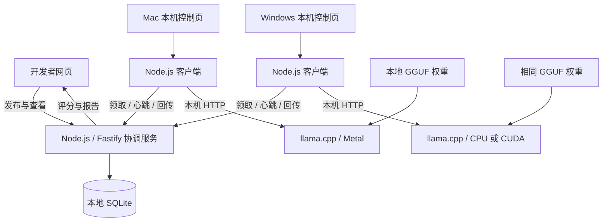

# HackCMU 校园算力互助评测平台策划案

> 工作名称：Campus Compute。日期：2026-09-11；版本：讨论后策划稿 v1.0。  
> 阶段：设计已确认，Codex 正在实现；当前进度与实测证据见 [开发记录](../../validation/implementation-progress.md)。  
> 本稿取代 2026-09-09 的浏览器文档索引方案。已确认方向与初始实施参数在下文分别标明。

配套文件：[代码级实施总计划与三份分工计划](../plans/2026-09-11-campus-compute-implementation.md)。原实施步骤保留作验收依据，实际执行状态以开发记录为准。

## 1. 项目定义与比赛目标

让校园里的小模型应用开发者发布批量评测任务，由自愿加入的 Mac 和 Windows 电脑执行 AI 推理。贡献者控制自己的参与节奏，并能暂停、退出和重新加入；开发者获得提示词版本之间可追溯的比较报告。

首个案例：为一个科学选择题助手比较三个提示词版本。同一批 200 道题产生 600 个独立推理任务，分配给多台电脑，每台运行相同的完整小模型。

参赛 track 为 optimization。优化对象是异构设备上的任务分配、闲置时段利用和退出后的工作恢复。最直接的衡量方式是整批任务完成时间、有效吞吐量、设备空闲时间与重算量。

项目适合一天黑客松的前提：早期验证本地模型和跨系统连接，复用成熟推理引擎，围绕一种任务类型完成发布、计算、恢复、报告的完整流程。加速倍率、正常使用时的干扰程度和真实用户需求均需要验证。

## 2. 已确认条件与交付边界

| 条件 | 当前约定 |
|---|---|
| 团队与时间 | 约 4 人，约一天开发；展示时间 3 分钟 |
| 已知设备 | 原有 4 台 M 系列 Mac，性能不一，最低 8GB 内存；另需支持用户提到的高配 Windows 电脑 |
| Windows 信息 | 确切数量、CPU、显卡、显存和可用于实测的时间尚未提供，不据此虚构设备清单 |
| AI 要求 | 必须真实执行模型推理 |
| 分布方式 | 完整小模型按题目并行；首版不做模型切片或训练 |
| 参与方式 | 本地轻量客户端，网页控制与查看；不要求浏览器执行推理 |
| 支持目标 | macOS Apple Silicon；Windows 原生客户端，CPU 路径与实际设备适用的 GPU 路径 |
| 展示方式 | 队员操作已准备好的电脑，不依赖评委手机参与 |
| 需求场景 | 小模型应用开发者的批量提示词对比与回归评测 |
| 协作范围 | 同一受信任校园小组，预定义推理任务，单个协调服务 |

建议一台电脑运行协调服务及主展示网页，其余设备贡献推理。协调服务电脑默认不执行评测推理；若同时启用 Worker，应在拓扑和性能记录中明确。设备数量以实际清单为准。

本文的队列协议、输入上限、时间参数和页面细节是落实已确认方向的设计默认值。硬件测试可据证据调整；调整后同步文档、配置和验收记录。本文没有将这些默认值写成已测结果。

## 3. 需求、重复使用与项目区别

### 3.1 需求者与产出

目标使用者是开发本地小模型问答或分类应用的学生团队。一次提示词修改可能改善部分样本，也可能让已有样本答错或产生不可解析的输出；团队希望用成批、有标准答案的输入比较修改前后表现。

第一份产出是可导出的实验报告：每题原始回答、选项解析结果、正确与否、格式是否合格、实际生成量、失败记录，以及不同提示词的逐题变化。

ARC 是内置示例数据。平台也接受同结构的自定义选择题文件，让团队提交自己应用中的问题。持续需求来自新提示词、新数据或新的配置，以及多个团队的实验队列；完全相同的已完成计算默认复用结果。

lm-evaluation-harness 等项目证明批量评测是一类已有工作流，但不能据此声称已经找到 CMU 使用者。[S1] 比赛期间由队员在获得授权的情况下邀请至少一位潜在使用者审阅报告，记录其是否能据此做出提示词选择、是否有反复评测的需求。未取得反馈就明确记录需求尚未验证。

### 3.2 贡献者与运行成本

贡献者愿意让自己的设备在可接受的时段执行任务，并能控制参与程度。第一版采用主动开始、贡献档位、暂停、退出和可见贡献记录。

运行模型会消耗电力、产生热量、占用内存。空闲算力不等于免费能源。首版不宣称节能、不自动识别整机是否闲置，也不承诺用户工作完全不受影响。

### 3.3 已有工作与展示主张

BOINC 已具备志愿计算、资源偏好和贡献积分；Petals 和 exo 涉及跨设备模型推理。[S2]、[S3]、[S4]、[S5] 首版不把这些概念宣称为首创。

本项目的具体交付是一个校园批量评测流程：跨系统接入、机主控制、异构设备动态接单、退出恢复和可追溯报告。其实际效果由设备记录与对照实验支持。

## 4. 题库、模型与实验规范

### 4.1 内置题库

采用 `allenai/ai2_arc` 的 ARC-Challenge。它提供英文科学选择题、选项及标准答案；验证集为 299 题，测试集为 1,172 题。[S6]

开发与演示默认从验证集固定抽取 200 题，固定抽样种子为 42，保存最终题目 ID 清单和数据文件哈希。后续重跑使用已保存清单，不依赖不同语言随机数实现得到相同抽样结果。正式选择提示词后，可用未参与调参的测试集做独立检查，并分开报告。

提示词 B 使用 ARC-Challenge 训练集中的两道示例：`Mercury_SC_415702` 和 `MCAS_2009_5_6516`。数据准备时验证两个 ID 存在并保存内容，不把当前待评测题目的答案放进输入。附带数据集来源、许可与改动说明；数据集页面标示 CC BY-SA 4.0。[S6]

### 4.2 模型与推理配置

| 配置 | 初始选择 |
|---|---|
| 模型 | `Qwen/Qwen2.5-1.5B-Instruct-GGUF` |
| 权重文件 | `qwen2.5-1.5b-instruct-q4_k_m.gguf` |
| 下载体积 | 官方文件列表约 1.12 GB；不等于运行内存 [S7] |
| 推理引擎 | llama.cpp 本地 HTTP 服务，固定同一发布版本 |
| 上下文 | 2,048 tokens，包含聊天模板、题目、示例与输出预算 |
| 输出上限 | 每题 128 tokens；达到上限保留结果并标记截断 |
| 生成方式 | 贪心解码；固定聊天模板及其他生成参数 |
| 并发 | 每个物理设备一个 Worker、一个模型进程、一个在途题目 |

首次真机验证后记录模型完整 revision、权重 SHA-256、引擎版本、各平台二进制哈希、聊天模板与生成参数，生成统一 `inferenceKey`。平台二进制哈希可以不同，模型及实验语义配置必须一致；设备的 Metal、CUDA 或 CPU 后端单独记录。

不同硬件后端不保证逐 token 完全相同。第一版记录后端并检查固定样本的跨设备结果差异，不把差异直接视为作弊，也不混入不同模型或不同量化版本来提高某台机器的成绩。

领取任务后、实际生成前，客户端通过锁定版本的推理引擎计算模板化输入长度。输入加 128 tokens 超出 2,048 时，报告确定性的输入超限错误；不静默截断题目、选项或示例。单纯增加数据量不得靠重复题目或无用长输出制造需求。

### 4.3 三个默认提示词与评分

所有模板使用规范化后的选项标签。用户可以编辑模板中的指令文本；模型、解码方式和输出预算在一场实验中固定。

| 版本 | 指令内容 | 预期输出 |
|---|---|---|
| A 直接回答 | 回答科学选择题，只返回答案行 | `ANSWER: B` |
| B 两道示例 | 先给上述两个训练集问答示例，再按相同方式回答新题 | `ANSWER: B` |
| C 简短解释 | 用一至两句话说明理由，最后返回答案行 | 简短解释，末行 `ANSWER: B` |

解析规则：去掉输出首尾空白，最后一条非空行必须严格符合 `ANSWER: X`，其中 X 是当前题的有效大写选项标签。A、B 还要求整段输出只有这一行；C 允许前文解释。首版不使用第二个大模型判断解释质量。

最终答案正确率使用末行解析结果与标准答案比较；输出格式合格率独立统计。无法解析的回答计为错误且格式不合格；A、B 若额外输出了解释但末行正确，可以答案正确、格式不合格。报告保留两项指标及原始输出。

本实验衡量指定提示词下的生成式选择题表现，不使用官方榜单分数名称，也不与基于选项概率的 ARC 评测分数直接比较。C 是否值得增加生成成本，交由实测准确率、生成量与案例支持。

### 4.4 自定义题库

首版支持 UTF-8 JSONL，每行包含 `id`、`question`、`choices`、`answerKey`。`choices` 为包含 `label`、`text` 的数组。导入时要求 ID 唯一、2–8 个非空选项、标签唯一且答案指向某个选项；按原顺序映射成 A–H，并保留原标签与映射关系。

默认每个题库最多 1,000 题、文件不超过 2 MB；每题正文不超过 4,000 字符，每个选项不超过 1,000 字符。每场实验支持 1–3 个模板，每个模板不超过 6,000 字符。字符限制用于入口校验，最终上下文长度仍按 token 检查。

输入不合格时显示行号及原因，不创建半份题库或半场实验。上传页说明题目和提示词将发送给参与设备，标准答案由协调服务评分时使用；例题自带的答案属于提示词内容。

## 5. 第一版产品范围

| 优先级 | 能力 | 可观察交付 |
|---|---|---|
| P0 | 发布评测 | 内置 ARC、自定义 JSONL、模板编辑、产生独立任务 |
| P0 | 跨系统真实推理 | Mac 与 Windows 都能注册、领取、执行并回传 |
| P0 | 贡献控制 | 低／中／高、暂停接单、立即退出、恢复加入 |
| P0 | 持久队列 | 动态领取、租约续期、重试、去重、重启恢复 |
| P0 | 报告 | 原始回答、评分、逐题对比、失败统计、JSON 导出 |
| P0 | 状态与贡献 | 真实进度、节点状态、贡献次数、重分配事件 |
| P0 | 结果复用 | 相同计算使用缓存，单独显示复用量 |
| P0 | 可验证展示 | 单机／多机对照、固定分配／动态领取对照、退出恢复 |
| P1 | 图表润色 | 吞吐趋势、筛选、节点任务动画 |
| P1 | 高配设备多并发 | 完成单并发基准后，再研究批处理与多个槽位 |
| P1 | 更多 GPU 路径 | 实际 Windows 设备之外的 AMD／Intel GPU 验证 |

范围外：训练、模型切片、任意可执行代码和模型上传、实时聊天服务、自动闲置检测、精确 CPU／GPU 百分比限制、手机推理、支付交易、完整账号体系、公开陌生节点防作弊、多协调服务高可用、自动化 CI 集成。

首次支持指实际操作系统与后端组合的验证记录，不泛称全部 Windows 显卡可用。正式安装包、自动更新与开机后台服务也不属于一天版本。

## 6. 页面与用户流程

### 6.1 发布评测

网页依次提供实验名称、内置题库或文件上传、题目数量、1–3 个模板、固定模型与生成配置摘要。默认值为 ARC-Challenge 验证集 200 题、三个模板、预计 600 个任务。

提交前展示将创建的任务总量和预计可复用结果数，实际复用量以创建事务为准。没有实测速度时显示“等待设备完成首批任务后估算”，不预填完成时间。提交后进入实验详情；无人接单时显示等待设备。

### 6.2 贡献算力

贡献者下载对应系统的客户端与启动脚本，准备模型文件，运行本地控制页。在本机输入协调地址、加入码、设备名称，选择贡献档位并开始。

本机控制页由客户端只在 loopback 地址提供，沿用网页组件，负责开始、暂停、档位和退出。中央网页展示设备状态与贡献，不远程提高其他机主的参与强度。

接入流程为连接检查、模型文件检查、加载、本地固定短题试算、可领取任务。试算不进入实验成绩或积分。首次下载、加载和真正 ready 分开显示；仅建立连接不能算作已贡献算力。

模型文件保留在本地磁盘，后续接入复用。暂停保留模型；立即退出计算网络会终止本客户端启动的推理进程、释放其模型运行资源。本机控制页可以保持打开，等待机主再次开始。

### 6.3 实验与报告

运行中展示完成／总任务数、新计算／缓存命中数、正在计算数、重试数、失败数、最近 30 秒有效吞吐量与设备列表。事件日志至少包括接入、任务领取、结果接受、退出、租约到期和重新领取。

详情支持查看某题在各模板下的输入、原始回答、解析答案、标准答案与判分依据。模板比较表显示共同已完成题目上的阶段结果及样本数，避免用不同难度的已完成子集提前判定赢家。

完整报告包含配置、数据哈希、题目清单、逐题结果和执行记录，可下载 JSON。所有任务终结但存在系统失败时标为“完成，含失败任务”，不能显示全部评测成功。

## 7. 技术架构与跨平台部署

| 模块 | 技术选择 | 职责 |
|---|---|---|
| 网页 | React、Vite、TypeScript | 发布、报告、总览与可复用本机控制组件 |
| 协调服务 | Node.js、Fastify、TypeScript | 输入校验、任务协议、评分与聚合 |
| 持久状态 | SQLite，由单个协调进程访问 | 题库、实验、租约、结果、贡献与事件 |
| 本地客户端 | Node.js、TypeScript | 引擎生命周期、接单节奏、心跳、本机控制 |
| 推理引擎 | llama.cpp HTTP 服务 | 模板化、分词与实际生成 [S8] |

Mac 使用 Metal；Windows 若有受支持 NVIDIA 显卡则测试 CUDA，否则先使用 CPU。llama.cpp 提供这些后端与 Windows 构建路径。[S9]、[S10] 使用对应平台的原生二进制和启动脚本，Worker 业务代码共用；不把 Docker 或 WSL 作为贡献端前提。

客户端主动连接协调服务，各贡献电脑不需要彼此连通。本机推理端口仅监听 loopback。HTTP 用于领取、心跳、结果与状态查询；网页每 2 秒刷新快照，首版无需 WebSocket、Redis 或 Kubernetes。

比赛部署先验证局域网或队员热点，协调服务绑定可达地址；若校园网络隔离设备，切到已测试的备用网络。公开部署属于额外工作，不依赖比赛现场临时申请云资源。

运行中的 SQLite 及 WAL 文件放在协调机未同步的本地应用数据目录，不放在当前 Synology 同步项目目录中。模型放入各机本地缓存，源码目录保存清单与配置；备份使用一致性快照，不能直接复制正在变化的一组数据库文件。

## 8. 动态调度、贡献档位与退出

### 8.1 主动领取

每个设备最多持有一个有效租约。准备好且不在休息中的 Worker 主动领取；服务器在事务中分配一个排队任务。快设备完成后更早回来领取更多工作，不按操作系统猜测性能，也不事先把所有题目平均切成固定大块。

多个实验并存时，在有排队任务的实验之间轮转领取；实验内按保存的题目顺序，并交错排列模板 A、B、C。轮转是首版公平规则，不提供复杂优先级和用户配额。

### 8.2 贡献档位

设当前题实际本地推理耗时为 t，不包含下载、排队和上传等待。上传被确认后开始休息。

| 档位 | 下次允许领取时间 |
|---|---|
| 低 | 本次确认时刻 + 2t |
| 中 | 本次确认时刻 + t |
| 高 | 本次确认后即可领取 |

档位切换影响下一次领取；休息中切换时根据最近一题的确认时刻与耗时重新计算剩余时间。暂停和退出可以打断休息，不能等计时器走完才生效。休息期间仍发心跳，但不持有已完成任务的租约。

这些规则控制持续工作节奏，不限制单次推理期间的瞬时负载，也不保证特定 CPU／GPU 占用或功耗。首版 UI 只展示贡献档位与实测状态，不将档位换算成“贡献 25% 算力”等数字。

### 8.3 暂停、退出与失联

- 暂停接单：立即禁止后续领取；当前题继续执行并回传，完成后进入暂停，模型保留。无在途任务时立即暂停。
- 立即退出：禁止领取，终止本客户端拥有的推理进程，再尽力释放在途租约并注销计算会话。控制程序可留在本机等待再次开始。
- 终端关闭：处理正常终止信号并清理子进程。测试 Windows 进程树与 Mac 子进程清理，不能只关控制页就宣称 GPU 已停止。
- 突然断网、睡眠或断电：租约停止续期，到期后回到队列。模型生成期间心跳独立运行，不能被等待生成结果阻塞。
- 发现租约失效或实验已取消：客户端停止旧任务；必要时终止并重新启动自己拥有的推理进程，避免后台旧生成与下一题重叠。

不保存单题的中间生成状态。退出导致的未完成题目从头重做，已被协调服务接受的题目不重做。

## 9. 租约、结果一致性与缓存

### 9.1 状态与初始时间参数

任务基本状态为 `queued → leased → completed`；可重试失败或租约过期后回到 `queued`；确定性输入错误或重试用尽进入 `failed`。取消实验停止发放任务，未完成任务进入 `canceled`。

初始参数：心跳每 3 秒；有效领取／续期后租约延长 20 秒；协调服务每 1 秒回收过期租约；无任务时每 2 秒再询问；本地单题执行上限 120 秒。单题上限由客户端和服务端共同执行，心跳不能无限延长同一次执行。H0–H3 的长样本测试决定是否调整，正式测量前冻结。

一次任务最多容忍 3 次可重试故障，计入引擎异常、执行超时与租约过期。主动退出释放不计为故障；输入超限等确定性错误直接终结并报告原因。全部设备离开且没有有效租约时，排队工作保持等待，不凭空消耗重试次数。

### 9.2 接受与去重

领取生成不可复用的 `leaseId`。提交包含 `experimentId`、`taskId`、`leaseId`、`workerId`、`inferenceKey`、原始输出、结束原因、输入／输出 token 数和本地耗时。

服务端校验身份、租约、配置、字段类型、非负有限计数和输出长度上限 64 KB。正常结束但答案错误、格式错误、空输出或达到输出上限的推理，仍可成为有效评测结果；客户端崩溃和未完成生成属于执行失败。

保存结果、更新任务，以及该模式适用的贡献与缓存写入，必须在同一事务中完成。一个任务只能接受一个结果。先检查是否已有同一租约的成功记录：有则返回原确认，即使该租约现在已过期也不重新结算。尚未成功提交的过期租约，或其他租约的迟到提交，被拒绝且不能覆盖新结果。

答案解析和评分在服务端完成。原始输出按普通文本展示。请求者提交的是固定结构的题目和指令，不向 Worker 下发 shell 命令或可执行代码。

### 9.3 结果复用与贡献

`workKey` 由规范化题目／选项内容、完整渲染提示词、`inferenceKey`、生成配置共同确定。模型、模板或输入改变会形成不同计算。标准答案变化可以重新评分，但无须重新生成同一回答；评分规则版本也随报告保存。

常规实验创建时查找已接受结果：缓存命中的任务引用旧结果并立即完成，标为缓存复用，不再派发或计分。多个并行实验遇到同一尚未完成的计算，首版不合并在途任务；报告记录可能发生的重复工作。

每个实际新执行且首次被接受的普通任务记 1 credit；同一 taskId 重复提交不加分，缓存命中不加分。计分基于已接受任务，不能等价于 FLOPs、能耗或跨任务公平报酬。不同实验的在途重复计算仍按各自首次接受的任务记录，并在重算分析中区分。

为了测量推理性能，可以显式创建“性能测试”实验绕过结果缓存的读取与写入；此类实验保存独立结果但不产生互助积分。现场需要真实重新执行时也使用这一显式模式，界面显示用途，避免伪装成新的用户需求。

SQLite 持久保存已接受结果；协调服务重启后恢复租约扫描。租约到期再分配未完成工作，重复计算允许发生，重复结算不允许发生。首版协调服务为单点，离线期间客户端显示连接异常并停止领取。

## 10. 模块、数据和接口边界

以下为设计接口，不表示代码已经存在。实施计划再冻结具体类型、依赖版本及文件路径。

| 数据对象 | 保存内容与约束 |
|---|---|
| Dataset / Sample | 数据来源、许可、文件哈希、题目、原标签映射与标准答案 |
| Experiment / Variant | 题目清单、提示词、渲染版本、inferenceKey、模式、管理令牌摘要 |
| Task / Attempt | sampleId 与 variantId、状态、workerId、leaseId、期限、故障次数 |
| Result | 原始回答、解析与评分、执行后端、token 数、结束原因、结果来源 |
| Worker | 名称、操作系统、硬件自报信息、后端、状态、最近心跳、会话令牌摘要 |
| ResultCache | workKey 到可复用原始推理结果的映射 |
| CreditEntry | 唯一 taskId、workerId、积分及协调服务接受时间 |
| Event | 领取、退出、过期、重分配、接受与错误记录 |

| 中央接口 | 主要行为 |
|---|---|
| `POST /api/datasets` | 原子导入内置清单或自定义题库；失败返回具体行号 |
| `POST /api/experiments/preview` | 校验选择与模板，估算任务总量及可复用量，不创建实验 |
| `POST /api/experiments` | 创建模板、任务与缓存引用；返回实验 ID 和管理令牌 |
| `GET /api/experiments/:id` | 返回进度、共同已完成样本比较、设备与事件摘要 |
| `GET /api/experiments/:id/report` | 返回逐题结果及配置；支持 JSON 下载 |
| `POST /api/experiments/:id/cancel` | 管理者取消；保留此前接受的结果与贡献 |
| `POST /api/workers/register` | 用加入码注册，返回独立 Worker 会话令牌 |
| `POST /api/workers/:id/heartbeat` | 更新实际状态、续期有效租约、返回取消或失效信息 |
| `POST /api/tasks/claim` | 事务领取一题；无任务返回 204；已有有效租约时不发第二题 |
| `POST /api/tasks/:id/result` | 校验租约、保存原始回答、评分、去重并返回确认 |
| `POST /api/tasks/:id/release` | 机主退出时主动归还有效租约 |
| `POST /api/tasks/:id/error` | 记录错误类别，按确定性／可重试规则处理 |
| `POST /api/workers/:id/leave` | 注销当前计算会话，回收仍由其持有的任务 |

本地控制接口提供状态查询及开始、修改档位、暂停、退出操作。它仅接受本机页面的合法会话请求；设置不可预测的本机会话令牌并校验 Origin，避免其他网页借 localhost 控制模型。服务端不会下发提升贡献强度的命令。

小组加入码、Worker 令牌和实验管理令牌分工明确。令牌通过请求头传递，不放在分享 URL 或日志中；服务端保存摘要。网页题目、模板、回答按普通文本渲染。首版可信小组的协议校验不构成陌生节点真实计算证明。

## 11. 报告与指标口径

### 11.1 模型质量

比较模板时，取各模板都已得到推理结果的共同题目集合 S。阶段准确率为集合 S 中答案正确数除以 |S|；阶段格式合格率为格式合格数除以 |S|。解析失败属于已得到结果且回答错误，不从分母剔除。

每个模板另列已得到结果数／计划题数、执行失败数和截断数。若全部题目成功执行，S 就是完整题库；若有执行失败，报告明确共同覆盖率及失败清单，不把部分样本成绩称为全量分数。S 为空时不显示百分比或优胜者。

逐题对比列出“旧版本正确、新版本错误”和相反情况。固定题库上的差异只支持这次实验的判断，不代表全部真实场景；改提示词后最终在独立测试数据上检查。

### 11.2 系统效率

| 指标 | 定义 |
|---|---|
| 新计算完成量 | 当前实验首次接受的真实推理任务数，不含缓存引用 |
| 有效吞吐量 | 最近 30 秒新计算完成量 / 30 秒；启动不足 30 秒时按实际窗口长度计算并标明窗口 |
| 稳态吞吐量 | 正式测量区间内新计算完成量 / 区间时间 |
| 整批完成时间 | 从统一放行任务领取，到最后一个成功结果被服务端接受 |
| 推理耗时 | Worker 对本地引擎请求计时，不含网络上传和主动休息 |
| 设备贡献 | 该设备首次被接受的新任务数，以及普通实验贡献积分 |
| 重试开销 | attempt 数、失败／作废 attempt 数及已有记录的耗时 |
| 退出恢复时间 | 服务端释放或最后有效续期、重新排队、重新领取、最终接受各时间点 |
| 冷启动成本 | 下载、模型加载、首个真实结果分别耗时多少 |

队列及接受时间用协调服务时钟，本地推理时长使用客户端单调时钟；不直接相减两台电脑的墙上时钟。原始 token 数和后端信息保留，不能把不同长度题目的每题耗时差全部归因于硬件。

缓存命中不计入新计算吞吐和当前设备积分。超过完成率门槛前不估算剩余时间：至少累计 10 个新结果且有 30 秒运行记录后，才允许按近期吞吐给出粗略估算；接入或退出后标明估算正在更新。

## 12. 验收标准

以下均为开发后的验收目标，当前状态全部为未执行。协议和评分逻辑用必要的自动化测试；实际推理、进程退出和跨平台能力必须用真机验证。

| 编号 | 场景 | 通过条件 |
|---|---|---|
| A01 | 导入与发布 | 内置 200 题 × 3 模板得到 600 个任务；非法 JSONL 显示行号且不留下半份数据 |
| A02 | 标签与评分 | 数字原标签正确映射；答对、答错、额外解释、无答案、无效标签、截断样本均按约定判分 |
| A03 | 本地真推理 | 一台 Mac 和一台 Windows 各完成至少 20 个真实任务；记录物理设备、引擎、模型哈希及后端 |
| A04 | 8GB 使用体验 | 在最低配置 Mac 上伴随浏览器与编辑器运行至少 10 分钟；无模型崩溃／内存分配失败；记录进程内存、系统内存压力和机主体验，并由机主判断档位是否可接受 |
| A05 | 动态领取 | 并发请求不会分配同一有效租约；每台最多一题；运行中加入的设备可领取剩余任务 |
| A06 | 贡献档位 | 连续至少 10 个任务的日志符合 2t／t／0 休息规则；允许 100ms 计时误差，额外网络等待不算休息不足 |
| A07 | 暂停与恢复 | 暂停后当前任务可完成，之后不再领取；恢复后沿用已加载模型 |
| A08 | 主动立即退出 | 点击后目标 2 秒内本客户端推理进程结束，未完成任务重新排队；记录实际响应时间与进程状态 |
| A09 | 突然失联 | 默认配置下最后有效续期约 21 秒内任务重新排队；其他设备完成它；记录实测时间 |
| A10 | 去重与竞争 | 相同成功提交重发不重复计数／计分；迟到租约被拒；结果与取消竞争有唯一终态 |
| A11 | 缓存复用 | 相同输入配置无需再推理；改模板产生新任务；只改标准答案可以复用原始输出并重新评分 |
| A12 | 异常与恢复 | 长题超限明确失败；故障预算用尽可见；全部节点离开可等待；协调服务重启保留已完成结果 |
| A13 | 积分一致 | 普通实验新计算首次接受数 = 本实验新增积分之和；缓存与性能测试不增加积分 |
| A14 | 报告可用 | 可以追溯任意题的输入、输出、判分、后端；共同子集分母正确；未完成／含失败报告有标识 |
| A15 | 数据配置一致 | 各机器同权重与实验配置；固定 20 题重复结果差异有记录与排查；不把硬件差异误称逐 token 保证 |
| A16 | 网络与访问 | 所有演示设备可连协调服务；切换备用网络后可重新加入；他人无法通过中央网页提高机主档位 |
| A17 | 对照测量 | 完成第 13 节两组基准并保留原始记录，无论结果是否显示加速都如实报告 |
| A18 | 现场演练 | 3 分钟内完整演示发布、混合设备工作、一次退出恢复、现场结果与历史报告的清楚区分 |

A04 是硬件与产品体验决策门槛，不是仅靠进程存活即可通过的测试。A03 若缺少 Windows 真机，应标为未验证，不能宣布首版跨平台验收完成。A08 的 2 秒是目标，若达不到需显示实际值并定位进程清理问题。

自动化重点为：并发领取、租约到期、相同提交重放、事务计分、取消竞争、缓存键与重新评分、标签归一化及评分分母。页面视觉与原生推理不靠模拟 Worker 代替验收。

## 13. 性能实验与效果判断

### 13.1 两组独立对照

第一组验证增加设备是否有用：先找出实测最强的单节点，将其单独运行与它加上其他可用设备共同运行比较。若高配 Windows 最强，就采用该 Windows；同一设备在两种情况下的档位、引擎设置和前台工作条件保持一致。

第二组验证分配策略是否有用：在相同设备集合上比较提前按任务数平均分配与动态领取。两种策略使用相同的混合模板任务清单、相同贡献档位和一题并发上限。固定分配仅是基准程序模式，不进入日常产品页面；无故障基准先隔离调度效果，退出恢复另做测试。

### 13.2 测量协议

1. 保存设备、CPU／GPU／内存、系统、后端、模型与配置、网络、供电和前台工作情况。所有设备连接电源，关闭系统自动睡眠，保持相近的前台负载；这些是基准条件，不是产品必须永远满负载的要求。
2. 预加载模型，在统一开始信号前禁止领取。冷启动另测，不混入稳态加速结果。推理引擎内部提示词缓存也要保持相同清理／预热规则并记录。
3. 使用同一份固定且不灌水的题目 × 模板清单。性能测试模式绕过结果缓存的读取与写入，任务依然真实执行、评分与保存；不计积分。
4. 每个条件默认运行 3 次，交替顺序并记录原始时间、中位数、范围和失败率。样本量在正式比较前根据试跑冻结，两组不能临时使用不同清单。
5. 加速比为单机整批时间 / 多机整批时间；同时报告实际设备数和新计算吞吐。执行失败的运行单独标记，不靠提前失败得到更短的“完成时间”。
6. 在多设备运行中进行独立的主动退出和失联实验，记录任务恢复与废弃计算。此结果不混入无故障速度对照。

首版单并发基准只能说明所列配置的效果。高配 GPU 可能从批处理获益；本项目不能据此宣称胜过经过专门优化的单机推理服务。若时间允许，单独记录高配设备合理批处理的额外基线。

效果判断：多设备的收益若小于运行波动，不宣称稳定加速。若无明显增益，先检查任务过短、客户端／网络开销、慢节点尾部任务和单机配置；报告实际结果。不能限速单机、拉长无用输出、复用缓存冒充新计算或隐藏强设备，来制造收益。

“利用闲置资源”的补充实验在 8GB Mac 上保持相同日常操作，比较不贡献与低／中档时的体验、内存压力和任务完成量。未测能耗时只报告算力使用与任务产出。

## 14. 四人工作包与一天排期

### 14.1 人员职责

| 队员 | 主要职责 | 首个交付 |
|---|---|---|
| A | 协调服务、SQLite、任务状态、租约与贡献事务 | 一题可以原子领取并接受结果 |
| B | 本地 Worker、Mac／Windows 引擎接入、档位、进程退出 | 一台真机可被控制地运行并上传回答 |
| C | 发布、总览、报告、本机控制页面 | 一场真实实验从提交进入结果页 |
| D | 题库与评分、跨设备验证、网络部署、基准和演示统筹 | 固定数据与评分样例、设备和网络验证记录 |

D 提供评分模块，A 集成入接受结果事务；C 与 B 对齐本机控制接口。Windows 优先由实际持有者配合 B、D 验证。四人在开始时冻结输入／输出契约；不各自发明同一字段的不同名称。

### 14.2 交付顺序

| 工作包 | 完成物 | 主要依赖 |
|---|---|---|
| W1 模型、数据与网络 | 8GB Mac 和 Windows 试跑；固定题库、模型清单、评分规则与协调地址 | 无 |
| W2 单节点完整流程 | 发布一个小实验，领取、真实推理、保存、评分并查看 | W1 |
| W3 混合设备与贡献控制 | Mac／Windows 同时工作，档位、暂停、退出与恢复 | W2 |
| W4 状态与一致性 | 租约、重试、去重、缓存、积分、重启和取消 | W2；与 W3 联调 |
| W5 需求端报告 | 自定义题库、模板比较、共同子集、失败详情和导出 | W2、W4 |
| W6 测量与验收 | 两组性能基准、8GB 体验、跨平台验收记录 | W3–W5 |
| W7 比赛交付 | 三分钟演练、真实报告、备用录像、启动说明与来源清单 | W6 |

### 14.3 24 小时参考安排

H0 指比赛允许开始开发的时刻。该表是相对排期，不表示已核查当届赛程或允许提前开发。时间包含轮换休息、等待和缓冲，不要求每个人连续工作 24 小时。

| 时段 | 主目标 | 检查点 |
|---|---|---|
| H0–H3 | W1；各模块围绕同一契约准备 | 两系统真实推理、最低内存机器测试、所有设备能连协调地址 |
| H3–H6 | W2；C、D 接入最小发布与结果 | 一台设备完成一场小评测；保存真实原始输出 |
| H6–H10 | W3、W4；持续合并与联调 | 混合接单、档位、暂停、退出重分配与重复提交正确 |
| H10–H14 | W4、W5 | 自定义导入、评分对比、缓存、导出、积分贯通 |
| H14–H17 | P0 联合验收，停止加功能 | A01–A16 有记录，关键失败先修复 |
| H17–H20 | W6；并行准备讲解材料 | 基准原始记录与完整报告，实际限制写入展示 |
| H20–H22 | W7；两轮计时演练和备用录像 | 明确现场与历史结果，备用网络可用 |
| H22–H24 | 提交、最后修复与缓冲 | 源码、启动说明、报告、演示与来源清单齐全 |

如果只剩较少开发时间，先删除 P1、复杂图表和安装包润色，保留固定单模型及完整工作流程。H6 仍未完成单节点流程时，四人优先排查这条流程；不能让三套漂亮页面掩盖模型未实际运行。

## 15. 早期决策门槛与应对

| 风险或未知 | 最迟检查点 | 应对 |
|---|---|---|
| 8GB Mac 内存或体验不可接受 | H3 | 检查常驻内存、上下文与进程数；调低参与节奏；仍不合适则统一重新选模型并更新实验，不能让该节点悄悄换模型 |
| Windows GPU 路径有问题 | H3 | 先验证原生 CPU 流程，再定位实际显卡与驱动；CUDA 是否完成单独记录 |
| 无法取得 Windows 真机 | H3 | 保留跨平台实现目标和验证清单，报告尚未实测；跨平台验收不标通过 |
| 校园网络隔离 | H3 | 使用经验证的队员热点或可达局域网；预缓存权重与运行时 |
| 引擎退出后仍在计算 | H10 | 修复本客户端拥有的进程树清理；以进程状态验收，不能只修改网页状态 |
| 重试导致重复积分或错覆盖 | H10 | A、B 优先修复事务、租约与重放测试，推迟图表 |
| 小模型表现不理想 | H14 | 检查模板、选项映射、截断与模型版本；错误本身可用于评测，不承诺某版本必然更优 |
| 实际任务太快，分布式无收益 | H20 | 如实记录开销；在既定有效题库规模下重测，保留有证据的调度与恢复结果 |
| 高配 Windows 完成大多数工作 | H20 | 展示实际贡献比例；重点判断其他设备是否提供可测增量 |
| 用户反馈不足 | 材料冻结前 | 将需求写为待验证假设，不虚构长期采用或已节省费用 |
| 现场故障 | 演练阶段准备 | 备用网络、可重复启动配置与标明为录像的备份；不把录像装成直播 |

## 16. 三分钟展示方案

演示主题：一位开发者要评估提示词修改；几台系统与性能不同的电脑临时协作，机主可以退出，开发者仍能拿到可用结果。

| 时间 | 操作 | 观众看到什么 |
|---|---|---|
| 0:00–0:20 | 用一题和三个提示词解释需求 | 为什么一次修改会产生整批推理，而不是只问模型一个问题 |
| 0:20–0:45 | 提交 200 题 × 3 模板的实验 | 真实任务进入队列，第一台设备开始工作 |
| 0:45–1:15 | 让准备好的 Windows 和另一台 Mac 开始接单 | 不同设备完成不同任务，实际贡献量不同 |
| 1:15–1:45 | 在有任务执行时点击一台的立即退出 | 本机推理停止，未完成任务由其他设备领取 |
| 1:45–2:15 | 打开现场的一题结果和阶段比较 | 回答、评分依据与明确标识的阶段样本数 |
| 2:15–2:45 | 切换到事先完成的完整报告及性能对照 | 对开发者有用的结果，以及测得的单机／多机收益 |
| 2:45–3:00 | 说明适用场景与已完成能力 | 跨系统、动态参与、可恢复的批量 AI 评测 |

演示设备事先下载并加载模型，明确说明已预加载；不把热启动体验当作首次安装速度。完整 600 项任务不必在 3 分钟内结束，现场阶段数据与此前完整报告使用不同标题和实验 ID。

提前的性能测试绕过缓存读写，因此可以保留完整基准报告而不填充普通作业缓存。首次现场普通实验应确认实际有待计算任务；若再次演示完全相同的计算，使用显式性能测试模式，显示正在真实重跑且不增加积分。正常用户作业仍默认复用结果。

主动退出与突然失联是不同情形。三分钟主演示优先展示主动退出；另用已经验收的日志或明确标识的录像说明突然失联恢复，不能把主动释放说成自动识别断网。

英文介绍草案：

> Campus Compute pools voluntarily contributed computing time from Macs and Windows PCs to run batch evaluations for small AI models. Developers submit a test set and prompt variants. Each computer runs independent inference tasks, contributors choose their participation level, and unfinished work is reassigned when a device leaves. Developers receive a traceable comparison report.

实际加速数据只有测出后才加入讲稿。评委无需安装客户端或现场加入。

## 17. 交付物与下一阶段

本节记录原策划阶段的交付约定。代码开发与本机验证已经开始，实际状态以开发记录为准。旧浏览器文档索引方案作为历史记录保留，不作为开发依据。

比赛开发完成时应交付：

1. 源码和协调服务、Mac 客户端、Windows 客户端的可复现启动说明。
2. 固定模型／引擎／数据／依赖清单及来源许可说明。
3. 内置题库与自定义输入模板、至少一份可追溯完整报告。
4. 自动化协议与评分验证记录、真机设备矩阵、失败与限制说明。
5. 两组基准的原始数据与图表，3 分钟演示材料及备用录像。

代码级实施计划已确认，用户已指定全部开发由 Codex 实现。原工作包作为实现与验收依据，物理设备接入及现场操作仍需要设备机主参与。

长期扩展由实际需求决定：更多任务类型、自动闲置感知、高配设备批处理、可靠后台运行、配额、陌生节点结果核验。只有在真实任务需要单机装不下的模型时，再另行研究模型切片。

## 18. 资料依据

技术来源核查日期为 2026-09-11。模型大小、数据结构和引擎支持来自下列来源；调度规则、时间上限、排期和验收门槛为本项目设计，来源并未保证这些配置的运行效果。

- **[S1]** [lm-evaluation-harness](https://github.com/EleutherAI/lm-evaluation-harness)：已有的批量语言模型评测、模板与结果记录工作流。
- **[S2]** [BOINC 资源偏好](https://github.com/BOINC/boinc/wiki/Preferences)：志愿计算的资源与运行偏好先例。
- **[S3]** [BOINC 贡献积分](https://github.com/BOINC/boinc/wiki/Computation-credit)：已有贡献记录机制。
- **[S4]** [Petals 论文](https://arxiv.org/abs/2312.08361)：异构动态设备上的分布式大模型推理相关工作。
- **[S5]** [exo 官方仓库](https://github.com/exo-explore/exo)：跨设备 AI 推理相关项目。
- **[S6]** [ARC 官方数据集](https://huggingface.co/datasets/allenai/ai2_arc)：题目、标签、数据划分、示例与许可信息。
- **[S7]** [Qwen 官方 GGUF 文件](https://huggingface.co/Qwen/Qwen2.5-1.5B-Instruct-GGUF/tree/main)：Q4_K_M 文件与标示体积。
- **[S8]** [llama.cpp 服务文档](https://github.com/ggml-org/llama.cpp/blob/master/tools/server/README.md)：本地 HTTP 推理与生成配置。
- **[S9]** [llama.cpp 官方仓库](https://github.com/ggml-org/llama.cpp)：Apple Silicon、Metal、CUDA 与 CPU 后端支持。
- **[S10]** [llama.cpp 构建文档](https://github.com/ggml-org/llama.cpp/blob/master/docs/build.md)：Windows 原生构建及硬件后端路径。

[S1]: https://github.com/EleutherAI/lm-evaluation-harness
[S2]: https://github.com/BOINC/boinc/wiki/Preferences
[S3]: https://github.com/BOINC/boinc/wiki/Computation-credit
[S4]: https://arxiv.org/abs/2312.08361
[S5]: https://github.com/exo-explore/exo
[S6]: https://huggingface.co/datasets/allenai/ai2_arc
[S7]: https://huggingface.co/Qwen/Qwen2.5-1.5B-Instruct-GGUF/tree/main
[S8]: https://github.com/ggml-org/llama.cpp/blob/master/tools/server/README.md
[S9]: https://github.com/ggml-org/llama.cpp
[S10]: https://github.com/ggml-org/llama.cpp/blob/master/docs/build.md
